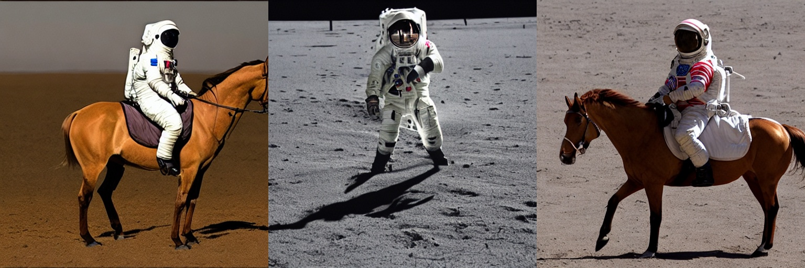

# stable-diffusion



## pre-trained models
[stable-diffusion](https://huggingface.co/CompVis/stable-diffusion-v1-4)  
[clip model](https://huggingface.co/openai/clip-vit-large-patch14)

### txt2img
```python
CUDA_VISIBLE_DEVICES=0 python scripts/txt2img.py \
                    --prompt "a photograph of an astronaut riding a horse" \
                    --plms \
                    --negative_prompt "a brown horse" \
```

### TODO
- [ ] tutorial writing
- [ ] video tutorial

